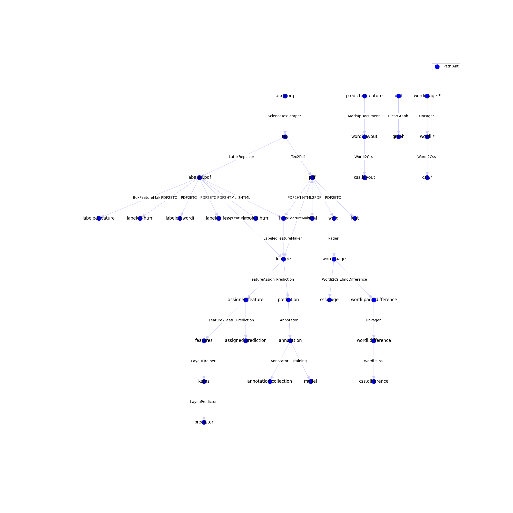

# 1, 2 oder 3 Spalten-Analyse

## _Wie schwierieg kann das sein?_

3     | 2    | 1 
--------|-----|------
 |  | 

---

##Inhalt

1. Motivation
2. Alternative Ansätze
3. Versuche
4. Lösung?

---

# Motivation

* _Natural Language Processing_ und _Natural Language Understanding_  -- bestmögliches Preprocessing notwendig

* Seitenzahlen, Bildunterschriften Fußnoten, Überschriften, Randnotizen, Tabellen, Bibliographie stört und zerstört den Textfluss.

* Portable Document Format (PDF) == Grab für den semantischen Inhalt

--- 

# Ansätze

1. Kein Layout/Processing, d.h. direkt OCR, Apache Tika, PDF-Miner
2. Heuristik
3. Machine learning - Clustering
4. Deep-Learning

---

#Packages im Internet:

Die meisten Ansätze bleiben dabei, keine Spalten zu berücksichtigen/den Text von Überschriften, Fußnoten, Seitenzahlen, Bildern und Tabellen zu befreien.

Für Natural Language Processing ist aber Preprocessing sehr entscheidend, analog zu Elephant in the Room


(https://arxiv.org/pdf/1808.03305.pdf)


---

# Versuche

1. Machine Learning mit Clustering Algorithmen
2. Machine Learning mit zeilenbasierten Features
3. Machine Learning mit Pretrained Layout-Modellen


--- 

#Zwickmühlen des Layouts

- Soft:

   - Spaltenlayout ohne 2. Spalte

   - Spaltenlayout wechselt auf gleicher Seite

   - Bild/Tabellen-Texte in 2 Spalten-Layout
    

- Hart:

    - Mathematik/Pseudocode/Symbole als inline-Text oder als selbstständige Kategorie?
   
    - Wenn selbstständig: Mathematik innerhalb von Fußnoten?


---

# Framework "Pfadameise"



**&#8594;  Pipeline-Architektur zum Anschließen diverser nlp-Anwendungen**


Quelle| ... | PREPROCESSING | (NLP-Anwendungen)
---|----|----| ---
.tex  &#8594; | .pdf &#8594; | .annotation &#8594; |.nlp
Papers/(arxiv.org) | Boxlayout/Text/Bild | Trainingsdaten | Anwendung


* für einen optimalen Bilbliothekskatalog, wo Gruppierung nach Themen, Suche nach konkreten Inhalten, konkrete Textanalyse in Bildern, Themenanalyse als Unterstützung für Leser:innen der unermesslichen Menge von wissenschaftlicher Literatur

---

# Machine Learning mit zeilenbasierten Features

Problem: Wie kann man den Kontext einer ganzen Seite einbeziehen?

* Winkel und Abstände zwischen den Textboxen
* "Dichte von Textboxenecken" (Gaussian Blur auf den durch den Text bedeckten Bereich)
---

# Machine Learning mit LayoutMV2

## Layout Modelle: 
    * generischere Modelle für Familien von Aufgaben:
https://github.com/microsoft/unilm

   * **Transformer**: "Attention" basierte Modelle ("Attention is all you need."
 https://arxiv.org/pdf/1706.03762.pdf), anders als LSTM-s durch einfache Matrixmultiplikation parallelisierbar. 
      

   * **Embeddings**: Features werden als Vektor repräsentiert, bsw. die "Bedeutung" von einem Wort, die Position einer Textbox. 


   * **Multimodal**: Verschiedene Arten von Features können miteinander verbunden werden und nicht "nur" repräsentierte kontinuierliche Werte oder Labelkategorien

---


# Pretraining Tasks 
Das Model lernt die Zusammenhänge zwischen den Embedding-Modalitäten

* **masking**: Masked Visual-Language Model: Nur mit den Positionen und umgebendem Text (ohne Bild) sollen einzelne Textteile vorhergesagt werden
* **covering**: Ein Dummy-Classifier wird als Downstreamtask angeschlossen, einzelne Textteile ausgewählt und deren Bildposition soll vorhergesagt werden.
* **text image matching** Mit einem Dummyclassifier werden Text und Bild von Dokumenten vertauscht und das Model soll die Zuordnung als wahr oder falsch angeben.

"soll" = Training.

---

###Features

Embeddings | Daten | Konkret
-----| ----- | ----
Text-Embeddings | Text in jeder Textbox | 4 Worte pro Textbox, estrahiert mit https://pypi.org/project/pdfminer.six/
Position-Embeddings| Liste mit den Textboxen, auf 1000*1000 skaliert | Textboxen von pdfminer.six
Bild-Embeddings | 255 * 255 Pixel Bild | extrem scaliertes Thumbnail jeder PDF-Seite


----

# Workflow

Wie bringt man ein Annotationsprojekt zum Laufen und erstellt ein eigenes Datenset, wenn man keins hat?

Datenset:

   * Starter-Datenset mit richtiger Struktur

   * Human-in-the-loop: Mensch korrigiert Predictions durch einfaches Interface und die annotierten Samples werden dem Datenset hinzugefügt. Nach einer gewissen Menge wird das Model wieder trainiert und der Mensch hat bei der Korrektur weniger zu tun. Das Datenset wird schnell größer.

   * ca. 1000 Samples nach 6 Tagen eine Stunde annotieren.


Labels für die Textboxen:

* Ganze Zeile, 1.-2.-3.-Spalte, Bild, Tabelle, Fußnote, Seitenzahl

Textextraktion:

* Alle Textspalten-Kategorien:

----

#Los gehts

(http://localhost:3000/annotation[http://localhost:3000/annotation]

Schickt mir doch nun eure besten pdfs!

----

# Rückschläge

* Preprocessing wirft einige Teile von der Seite weg
* Fehler im "Datasets-package" - man muss es forken und den Fehler bypassen, solange es nicht gefixt/verstanden ist
* Begrenzter Raum für Text-Feature. Vorgestelltes Model nutzt nur 4 Worte pro Textbox


----

# Andere Anwendungsfälle

- Formulare scannen: Ersatz für Teleform
- Tabellen analysieren


```
LayoutLM: Pre-training of Text and Layout for Document Image Understanding
Yiheng Xu, Minghao Li, Lei Cui, Shaohan Huang, Furu Wei, Ming Zhou
Pre-training techniques have been verified successfully in a variety of NLP tasks in recent years. Despite the widespread use of pre-training models for NLP applications, they almost exclusively focus on text-level manipulation, while neglecting layout and style information that is vital for document image understanding. In this paper, we propose the \textbf{LayoutLM} to jointly model interactions between text and layout information across scanned document images, which is beneficial for a great number of real-world document image understanding tasks such as information extraction from scanned documents. Furthermore, we also leverage image features to incorporate words' visual information into LayoutLM. To the best of our knowledge, this is the first time that text and layout are jointly learned in a single framework for document-level pre-training. It achieves new state-of-the-art results in several downstream tasks, including form understanding (from 70.72 to 79.27), receipt understanding (from 94.02 to 95.24) and document image classification (from 93.07 to 94.42). The code and pre-trained LayoutLM models are publicly available at \url{this https URL}.
```

---

---

# Ende


<script type="text/javascript" src="https://cdn.jsdelivr.net/npm/hackers-tiny-slide-deck@VERSION/build/htsd.min.js"></script>