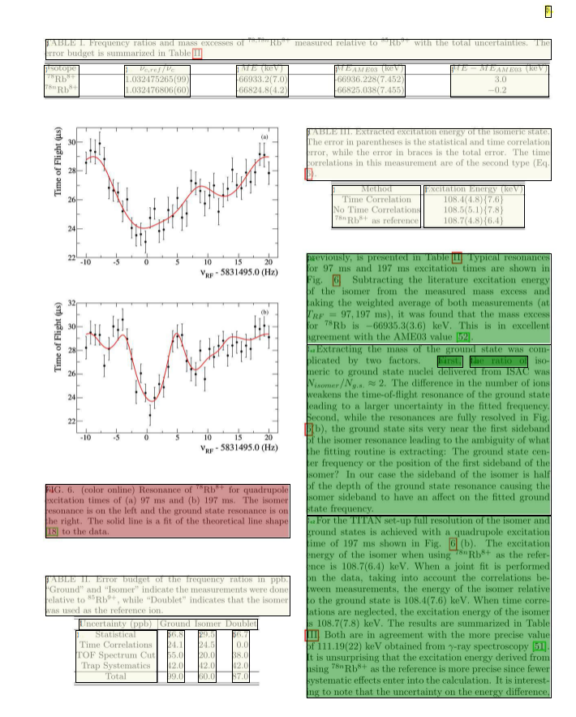
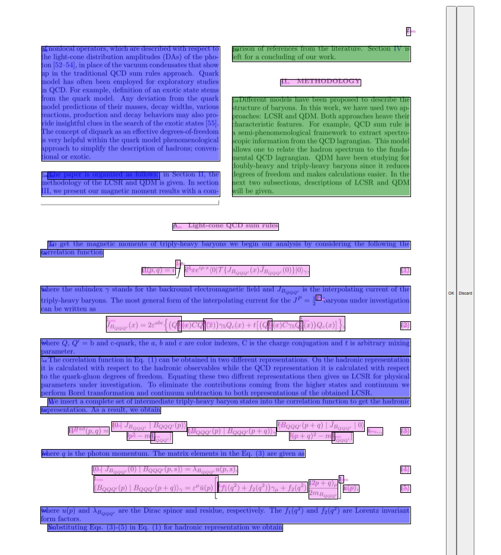
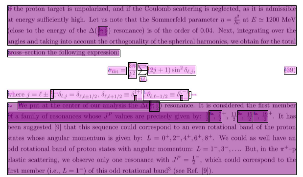
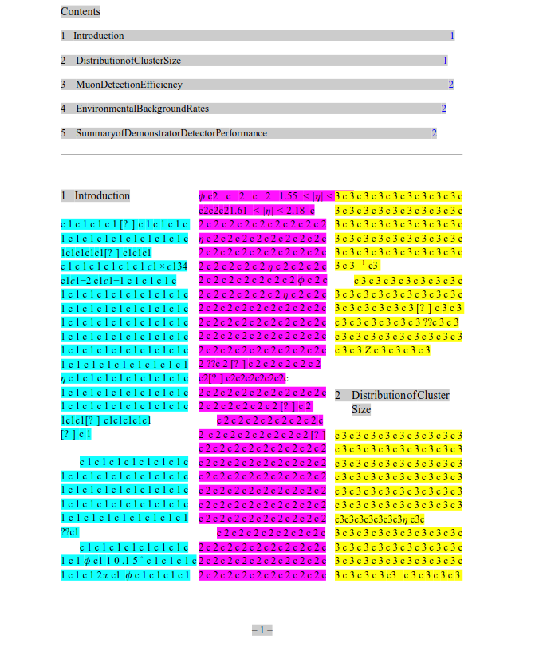

# 1, 2 oder 3 Spalten-Analyse

# _Wie schwierieg kann das sein?_

3       | 2    | 1 
--------|------|------
 |  | 

---

# Inhalt

1. Motivation
2. Alternative Ansätze
3. Versuche
4. Lösung?

---

# Motivation

* _Natural Language Processing_ und _Natural Language Understanding_  -- bestmögliches Preprocessing notwendig

**Für Natural Language Processing ist Preprocessing sehr entscheidend, analog zu Elephant in the Room**

(https://arxiv.org/pdf/1808.03305.pdf)

* Seitenzahlen, Bildunterschriften Fußnoten, Überschriften, Randnotizen, Tabellen, Bibliographie stört und zerstört den Textfluss.

* Portable Document Format (PDF) == Grab für den Text

--- 

# Ansätze

0. [Per Hand](https://bytescout.com/articles/how-to-extract-pdf-with-multiple-columns-to-text-using-pdf-multitool)

1. Kein Layout/Processing (Apache Tika, PDF-Miner)
2. Heuristik
   [K2pdfopt](https://willus.com/k2pdfopt/)
   
3. Machine learning - Clustering
   KMeans, HDBSCAN auf die Textboxen
   [Lifen](https://medium.com/lifen-engineering/fast-graph-based-layout-detection-19fc7ab11b17)
   
4. Deep-Learning und LayoutLMv2
   [LayoutLMv2-FUNSD](https://huggingface.co/spaces/nielsr/LayoutLMv2-FUNSD)
   Woher das Datenset?
   
---

# Versuche

1. Machine Learning mit Clustering Algorithmen
2. Machine Learning mit zeilenbasierten Features
3. Machine Learning mit Pretrained Layout-Modellen

--- 

# Zwickmühlen und Dilemmata bei dem Layout - Was kann der Mensch?

# Soft

   - Spaltenlayout ohne 2. Spalte

   - Spaltenlayout wechselt auf gleicher Seite

---

# Hart

  - Mathematik/Pseudocode/Symbole als inline-Text oder als selbstständige Kategorie?

   
  - Wenn selbstständig: Mathematik innerhalb von Fußnoten?

  - Bild  - Bild = Tabelle = Gleichung ?
  

---

# Framework "path of ants"

**&#8594;  Pipeline-Architektur zum Anschließen diverser nlp-Anwendungen**

Quelle| ... | PREPROCESSING | (NLP-Anwendungen)
---|----|----| ---
.tex  &#8594; | .pdf &#8594; | .annotation &#8594; |.nlp
Papers/(arxiv.org) | Boxlayout/Text/Bild | Trainingsdaten | Anwendung

* "Pipelineframework" für eine Anwendung mit vielen anschließenden Text-Applikationen (semantische Annotationen im Text, Topic-Modelling, Hörbücher, Kataloge)

---

# Woher das Datenset?

Allen Text entfernen und gegen Labels austauschen, um zu wissen, wo die Spalten sind?

(In Latex Befehle definieren, um die aktuelle Spalte zu erfragen. Welche Mühe!)

---

# Deep Learning mit LayoutLv2

# Transformer/Layout Modelle bei microsotfs "uniLM" Abteilung (unified language model): 
 * [generischere Modelle für Familien von Aufgaben](https://github.com/microsoft/unilm)
    
Erklärungen:

 * **Transformer**: "Attention" basierte Modelle ["Attention is all you need."](
 https://arxiv.org/pdf/1706.03762.pdf), anders als LSTM-s durch einfache **Matrixmultiplikation parallelisierbar**. 
      

   * **Embeddings**: Features werden als Vektor repräsentiert, bsw. die *"Bedeutung" von einem Wort* oder die *Position einer Textbox*. 

   * **Multimodal**: Verschiedene Arten von Features können miteinander verbunden werden und nicht "nur" repräsentierte kontinuierliche Werte oder Labelkategorien.

Transformer Modelle werden über **unsupervised learning** vortrainiert -- kein Datenset nötig
und dann durch **supervised learning** für spezifische Aufgaben einsetzbar

---

# Pretraining Tasks 
Das Transformer-Model lernt die Zusammenhänge zwischen den Embedding-Modalitäten durch folgende Aufgaben während des Pretraining

* **masking**: Masked Visual-Language Model: Nur mit den Positionen und umgebendem Text (ohne Bild) sollen einzelne Textteile vorhergesagt werden
* **covering**: Ein Dummy-Classifier wird als Downstreamtask angeschlossen, einzelne Textteile ausgewählt und deren Bildposition soll vorhergesagt werden
* **text image matching** Mit einem Dummyclassifier werden Text und Bild von Dokumenten vertauscht und das Model soll die Zuordnung als wahr oder falsch angeben

"soll" = Training

---

# Features

Embeddings | Daten | Konkret
-----| ----- | ----
Text-Embeddings | Text in jeder Textbox | 4 Worte pro Textbox, estrahiert mit https://pypi.org/project/pdfminer.six/
Position-Embeddings| Liste mit den Textboxen, auf 1000*1000 skaliert | Textboxen von pdfminer.six
Bild-Embeddings | 255 * 255 Pixel Bild | extrem scaliertes Thumbnail jeder PDF-Seite

----

# Workflow

Wie bringt man ein Annotationsprojekt zum Laufen und erstellt ein eigenes Datenset, wenn man keines hat? Human-In-The-Loop!

Datenset:

   * Starter-Datenset mit richtiger Struktur

      * Human-in-the-loop: 
         
        **WHILE TRUE:**
        
          - Mensch korrigiert Predictions durch einfaches Interface 
          - die annotierten Samples werden dem Datenset hinzugefügt. Nach einer gewissen Menge wird 
            
          - das Model wieder trainiert und 
            
          - der Mensch hat bei der Korrektur weniger zu tun
   
---

# Ergebnis

   * --> ca. 1000 Samples nach 6 Tagen eine Stunde annotieren.

Labels für die Textboxen:

* Ganze Zeile, 1.-2.-3.-Spalte, Bild, Tabelle, Fußnote, Seitenzahl

Textextraktion:

* Alle Textspalten-Kategorien werden sortiert

[**Annotieren**](http://localhost:3000/annotation)

----

# Los gehts

Schickt mir Eure besten (wissenschaftlichen) PDFs!

[**Hochladen**](http://localhost:3000/upload_annotation)

----

# Rückschläge

* Seltsames Preprocessing von LayoutLMv2 wirft einige Teile von der Seite weg (?!)

  
* Begrenzter Raum für Text-Feature. **Brauchbarstes  Model** nutzt nur 4 Worte pro Textbox

* Fehler im **datasets**-package - man muss es forken und den Fehler bypassen, solange es nicht gefixt/verstanden ist
  
* **pdf-miner.six** produziert Textboxen in Textboxen bei Mathematik. Wie wieder in den Text einfügen? --> Betrifft nur Mathematik, daher egal

----

# Andere Anwendungsideen?

- Formulare scannen: Ersatz für Teleform ()?
- Tabellen analysieren?

- ... (viele langweilige Fälle)

- und:

---

# Preprocessing für

 
---

LayoutLMv2 https://www.microsoft.com/en-us/research/publication/layoutlmv2-multi-modal-pre-training-for-visually-rich-document-understanding/

https://willus.com/k2pdfopt/

---

# The End

# Dankeschön

<link rel="stylesheet" href="htsd.min.css" />

