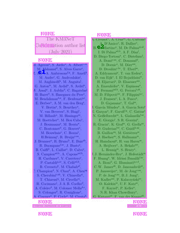
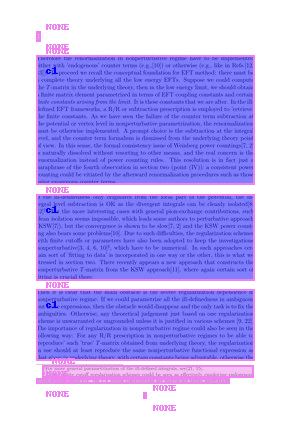

# 1, 2 oder 3 Spalten-Analyse

## _Wie schwierieg kann das sein?_

3     | 2    | 1 
--------|-----|------
 |  | 

---

##Inhalt

1. Motivation
2. Alternative Ansätze
3. Versuche
4. Lösung?

---

# Motivation

* _Natural Language Processing_ und _Natural Language Understanding_  -- bestmögliches Preprocessing notwendig

* Seitenzahlen, Bildunterschriften Fußnoten, Überschriften, Randnotizen, Tabellen, Bibliographie stört und zerstört den Textfluss.

* Portable Document Format (PDF) == Grab für den semantischen Inhalt

--- 

# Alternativen

1. ohne, d.h. direkt OCR, Apache Tika, PDF-Miner
2. per Hand und Schwellenwerte
3. Machine learning
4. Deep-Learning

---

#Packages im Internet:


---

# Versuche

1. Machine Learning mit Clustering Algorimen
2. Machine Learning mit Zeilenbasierten Features
3. Machine Learning mit LayoutMV2

---

# Machine Learning mit Clustering Algorimen

---

## Weniger Information ist mehr Information

Ersetzung des Inhalts durch Spaltenlabels


---

# Datenproduktion mit Latex-Ersetzung

Die "Pfadameise"


==> Graph von iterierenden Klassenobjekte, die über kurze Wegeanleitungen Pipelines erstellen kann

Quelle| ... | PREPROCESSING | (NLP-Anwendungen)
---|----|----| ---
.tex =>| .pdf =>| .annotation  => |.nlp
Papers | Boxlayout/Text/Bild | Trainingsdaten | Anwendung

---

# Machine Learning mit zeilenbasierten Features

Problem: Wie kann man den Kontext einer ganzen Seite einbeziehen?
--> Winkel und Abstände zwischen den Textboxen

---

# Machine Learning mit LayoutMV2


---

###Features

Embeddings | Daten
-----|----- | 
Text-Embeddings | Text in jeder Textbox
Bild-Embeddings | 255 * 255 Pixel Bild
Position-Embeddings| Liste mit den Textboxen, auf 1000*1000 skaliert


### Labels

Labels für die Textboxen
c1, c2, c3, None

Pooling "Kaleidoskop"

```
LayoutLM: Pre-training of Text and Layout for Document Image Understanding
Yiheng Xu, Minghao Li, Lei Cui, Shaohan Huang, Furu Wei, Ming Zhou
Pre-training techniques have been verified successfully in a variety of NLP tasks in recent years. Despite the widespread use of pre-training models for NLP applications, they almost exclusively focus on text-level manipulation, while neglecting layout and style information that is vital for document image understanding. In this paper, we propose the \textbf{LayoutLM} to jointly model interactions between text and layout information across scanned document images, which is beneficial for a great number of real-world document image understanding tasks such as information extraction from scanned documents. Furthermore, we also leverage image features to incorporate words' visual information into LayoutLM. To the best of our knowledge, this is the first time that text and layout are jointly learned in a single framework for document-level pre-training. It achieves new state-of-the-art results in several downstream tasks, including form understanding (from 70.72 to 79.27), receipt understanding (from 94.02 to 95.24) and document image classification (from 93.07 to 94.42). The code and pre-trained LayoutLM models are publicly available at \url{this https URL}.
```

---

---

# Ende

Tankeschoen

<script type="text/javascript" src="https://cdn.jsdelivr.net/npm/hackers-tiny-slide-deck@VERSION/build/htsd.min.js"></script>